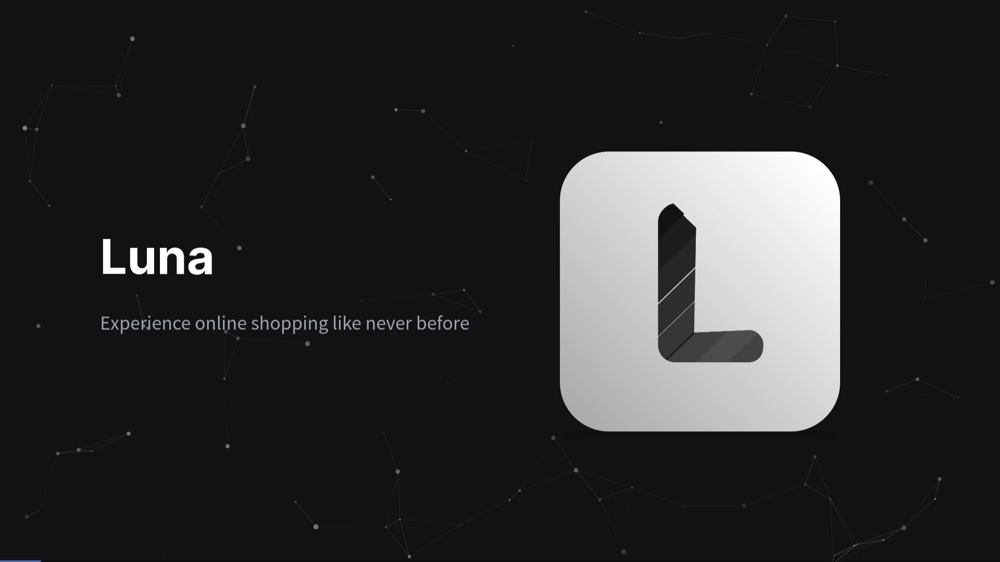

# Luna Pitch Deck

Experience Online Shopping Like Never Before

## Install dependencies

```bash
$ npm install
```

## Start local server

```
$ npm start
```
You can access it using the address `http://127.0.0.1:3000`

## Team
* [Maverick Fabroa](https://web.facebook.com/mavyfaby)
* [Shaye Pauliene Arenas](https://web.facebook.com/itzzowe)

## Slides

* Introduction
* Team
* Problem
* Advantages
* Solution
* Product and Features
* Traction
* Market
* Competition
* Business Model Canvas
* Investing
* Contact Us

## Note

* Not applicable for mobile phones
* For desktop view only
## Screenshot

